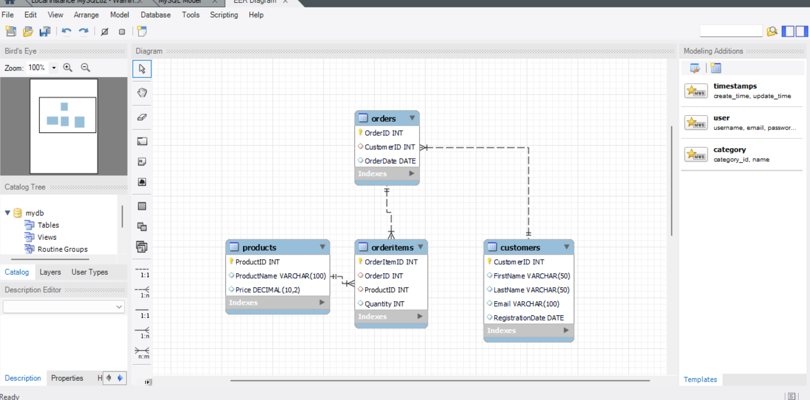
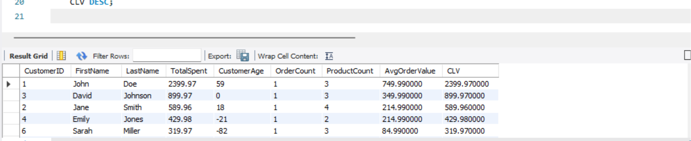
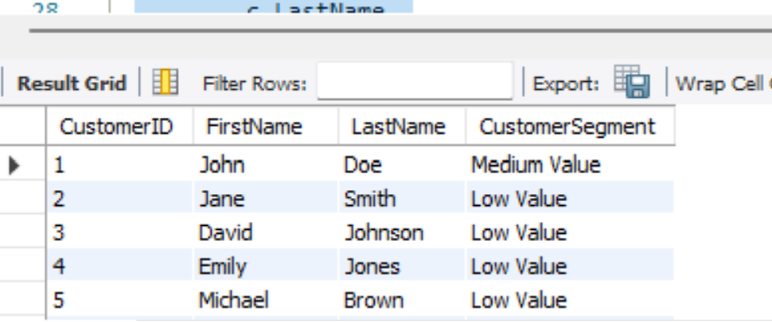
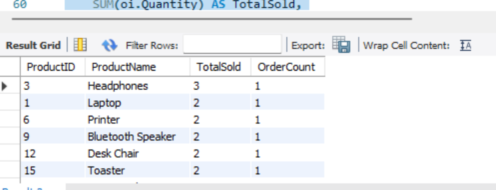
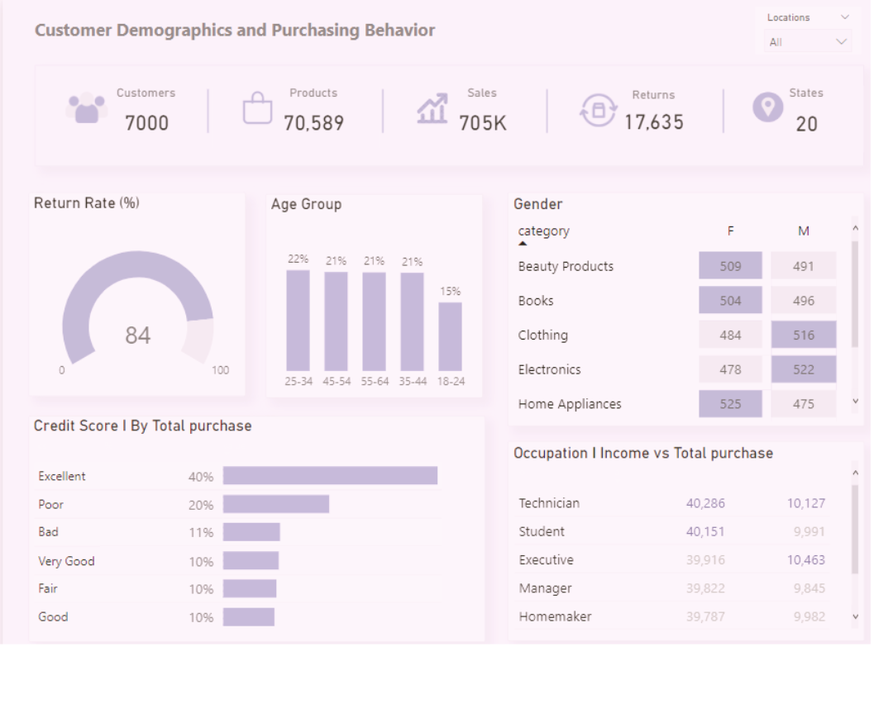

## **Customer Segment Analysis**


***
## **Introduction**

Imagine staring at a vast ocean, teeming with different fishes each with its unique traits and preferences. To understand this complex ecosystem, you wouldn't try to analyze each fish individually, right? You'd segment them: schools of tuna feeding on the surface, pods of dolphins playfully navigating the currents, and perhaps even the elusive giant squid lurking in the depths.

Customer segment analysis works similarly. It's like casting a net into the vast ocean of your customer base, pulling out distinct groups with shared characteristics and behaviors. But instead of fins and scales, these segments are defined by things like demographics, purchasing habits, and engagement patterns. By understanding these segments, you can:

- **Craft targeted marketing**: Tuna love bait, not seaweed snacks, right? Tailor your messages to each segment's needs.
- **Develop personalized offerings**: Dolphins might crave an underwater obstacle course, not a pressure-proof tablet. Create relevant products and services.
- **Boost customer retention**: Shower high-spenders with VIP treatment, and offer loyalty programs to budget-conscious customers.
- **Make informed business decisions**: Allocate resources and plan expansion based on segment insights.

So, are you ready to dive into the fascinating world of customer segment analysis? Buckle up, grab your data-wrangling gear, and prepare to discover the hidden depths of your customer base. The ocean of insights awaits!

***
## **Problem Statement**
We want to analyze customer segments based on their purchasing behavior. The goal is to identify different customer segments and understand their preferences. The significance of customer segmentation cannot be overstated, as it is a powerful tool that can help businesses generate more customers and increase revenue.

***
## **Project Scope**
**Customer Lifetime Value (CLV) Analysis**
- Evaluate the Customer Lifetime Value for each customer, considering factors such as total spending, the longevity of the customer relationship, and the frequency and scale of transactions.
- Classify customers into distinct segments based on their CLV, offering a nuanced understanding of their varying contributions to the business.
  
**Customer Segmentation**
- Utilize advanced SQL queries to segment customers effectively, leveraging CLV as a primary metric.
- Explore potential relationships between customer segments and additional attributes, providing a multidimensional view of customer behavior.

**Popular Product Identification**
- Identify the most popular products by analyzing the quantity sold and the frequency of orders.
- Uncover insights into product preferences and strategize around high-performing items to maximize revenue.

**Recommendations for Marketing Strategies**
- Devise actionable recommendations for marketing strategies tailored to different customer segments.
- Leverage insights from popular products to inform promotional activities and enhance customer engagement.
  
**Visual Representation**
- Employ visualizations, such as charts and graphs, to present key findings in an easily digestible format.
- Visualize trends, correlations, and outliers to facilitate stakeholder understanding and decision-making.

**Expected Outcomes**
- In-depth insights into customer segments and their corresponding CLV.
- Identification of popular products driving revenue and customer engagement.
- Actionable recommendations for marketing strategies tailored to diverse customer segments.
-Visual representations aiding in the interpretation and communication of key findings.

This project sets out to empower the e-commerce business with a strategic understanding of its customers, laying the foundation for informed decision-making and targeted growth initiatives. Through the lens of SQL data analysis, I aim to unveil patterns that transcend raw data, providing a roadmap for sustainable success in the competitive e-commerce landscape.

***
## **SQL Analysis**
After assessing the dataset, I identified that some attributes had repeating groups of values, which could lead to data redundancy and inconsistencies. Therefore, to avoid these issues, the dataset was normalized and broken down into different tables - Customers, Products, Orders, and orderitems - each with a single theme or entity.

```sql
-- Create Database
CREATE DATABASE ECommerceDB;
USE ECommerceDB;

-- Create Customers Table
CREATE TABLE Customers (
    CustomerID INT PRIMARY KEY,
    FirstName VARCHAR(50),
    LastName VARCHAR(50),
    Email VARCHAR(100),
    RegistrationDate DATE
);

-- Create Products Table
CREATE TABLE Products (
    ProductID INT PRIMARY KEY,
    ProductName VARCHAR(100),
    Price DECIMAL(10, 2)
);

-- Create Orders Table
CREATE TABLE Orders (
    OrderID INT PRIMARY KEY,
    CustomerID INT,
    OrderDate DATE,
    FOREIGN KEY (CustomerID) REFERENCES Customers(CustomerID)
);

-- Create OrderItems Table
CREATE TABLE OrderItems (
    OrderItemID INT PRIMARY KEY,
    OrderID INT,
    ProductID INT,
    Quantity INT,
    FOREIGN KEY (OrderID) REFERENCES Orders(OrderID),
    FOREIGN KEY (ProductID) REFERENCES Products(ProductID)
);
```
***
## **Entity Relationship Diagram**



With the tables created, I loaded the data from the original dataset into these tables to begin my analysis

Based on the problem statement provided, I identified several key business questions to explore. One of the primary questions I sought to address was: "What factors are most associated with customer purchasing behavior, and how can I leverage these insights to improve sales and revenue?". The following are the business questions I identified for analysis

1. **Calculate Customer Lifetime Value (CLV)**

```sql
-- Calculate CLV for each customer
SELECT
    c.CustomerID,
    c.FirstName,
    c.LastName,
    SUM(p.Price * oi.Quantity) AS TotalSpent,
    DATEDIFF(MAX(o.OrderDate), c.RegistrationDate) AS CustomerAge,
    COUNT(DISTINCT o.OrderID) AS OrderCount,
    SUM(oi.Quantity) AS ProductCount,
    AVG(p.Price) AS AvgOrderValue,
    SUM(p.Price * oi.Quantity) / COUNT(DISTINCT o.OrderID) AS CLV
FROM
    Customers c
JOIN Orders o ON c.CustomerID = o.CustomerID
JOIN OrderItems oi ON o.OrderID = oi.OrderID
JOIN Products p ON oi.ProductID = p.ProductID
GROUP BY
    c.CustomerID, c.FirstName, c.LastName, c.RegistrationDate
ORDER BY
    CLV DESC;
```



Calculating Customer Lifetime Value (CLV) is crucial for this project helps in making strategic decisions. With CLV, I gain insights into how much value each customer brings over their lifetime, enabling me to categorize them into high, medium, and low-value segments. This segmentation guides me in allocating resources effectively, tailoring marketing strategies, and focusing on customer retention. By understanding CLV, I can forecast future revenue, stay competitive, and adopt a customer-centric approach. Ultimately, CLV is my compass for maximizing revenue and building lasting relationships in the dynamic e-commerce landscape.

***
2. **Customer Segmentation based on CLV**

```sql
-- Segment customers based on CLV
WITH CustomerSegments AS (
    SELECT
        c.CustomerID,
        c.FirstName,
        c.LastName,
        SUM(p.Price * oi.Quantity) AS TotalSpent,
        DATEDIFF(MAX(o.OrderDate), c.RegistrationDate) AS CustomerAge,
        COUNT(DISTINCT o.OrderID) AS OrderCount,
        SUM(oi.Quantity) AS ProductCount,
        AVG(p.Price) AS AvgOrderValue,
        SUM(p.Price * oi.Quantity) / COUNT(DISTINCT o.OrderID) AS CLV
    FROM
        Customers c
    JOIN Orders o ON c.CustomerID = o.CustomerID
    JOIN OrderItems oi ON o.OrderID = oi.OrderID
    JOIN Products p ON oi.ProductID = p.ProductID
    GROUP BY
        c.CustomerID, c.FirstName, c.LastName, c.RegistrationDate
)
SELECT
    CustomerID,
    FirstName,
    LastName,
    CASE
        WHEN CLV > 5000 THEN 'High Value'
        WHEN CLV BETWEEN 1000 AND 5000 THEN 'Medium Value'
        ELSE 'Low Value'
    END AS CustomerSegment
FROM
    CustomerSegments;
```
***


Analyzing customer segmentation based on Customer Lifetime Value (CLV) is crucial for me in this project. By calculating CLV and categorizing customers into high, medium, and low-value segments, I gain a nuanced understanding of their contributions to the business. This segmentation guides my decision-making, allowing me to tailor marketing strategies and allocate resources effectively. Through this analysis, I aim to optimize customer engagement, enhance retention strategies, and ultimately drive sustainable growth.

***
**Identify Popular Products**

```sql
-- Identify popular products
SELECT
    p.ProductID,
    p.ProductName,
    SUM(oi.Quantity) AS TotalSold,
    COUNT(DISTINCT o.OrderID) AS OrderCount
FROM
    Products p
JOIN OrderItems oi ON p.ProductID = oi.ProductID
JOIN Orders o ON oi.OrderID = o.OrderID
GROUP BY
    p.ProductID, p.ProductName
ORDER BY
    TotalSold DESC;
```



Identifying popular products is a key aspect of my data analysis project, as it allows me to uncover insights into customer preferences and optimize marketing strategies. By analyzing the total quantity sold and the number of orders for each product, I gain a comprehensive understanding of which items are driving revenue and customer engagement. This information is vital for me to recommend targeted promotional activities, enhance product visibility, and maximize the overall impact on sales. In essence, identifying popular products empowers me to make informed decisions that contribute to the business's success.

***
4. Is there a relationship between age and total purchase value?
```sql
SELECT CASE 
	WHEN age between 18 AND 24 THEN '18-24'
	WHEN age between 25 AND 34 THEN '25-34'
	WHEN age between 35 AND 44 THEN '35-44'
	WHEN age between 45 AND 54 THEN '45-54'
	WHEN age between 55 AND 64 THEN '55-64'
 END AS age_group,
 ROUND(SUM(P.average_purchase_value):: numeric, 0) AS total_purchase
 FROM products p 
 JOIN customers c ON c.product_id = p.id
 GROUP BY 1
 ORDER BY 2 DESC;
```
| age_group | total_purchase                     |
|--------------|-----------                    |
|   25-34     |   152970 |
|   45-54     |  150335                  |
|    55-64   |   149281                      |
|    35-44   |   146736                    |
|     18-24  |   106114        |


***

5. What are the most popular products among male and female customers?
```sql
SELECT C.gender, p.product_purchased, COUNT (*) AS purchase_count
FROM customers c
JOIN products p ON p.id = c.product_id
GROUP BY 1, 2
ORDER BY 2;
```

| gender | product_Purchased | purchase_count |
|--------|------------------|---------------|
| Female | Sunglasses       | 509           |
| Male   | Sunglasses       | 491           |
| Male   | Books            | 496           |
| Female | Books            | 504           |
| Female | Fitness Tracker  | 484           |
| Male   | Fitness Tracker  | 516           |
| Female | Electronics      | 478           |
| Male   | Electronics      | 522           |
| Male   | HeadPhones       | 475           |
| Female | HeadPhones       | 525           |
| Female | Laptop           | 504           |
| Male   | Laptop           | 496           |
| Male   | Tablets          | 504           |
| Female | Tablets          | 496           |


***
Data Visualization


***
## **Recommendations**

1. **Targeted Engagement for High-Value Customers:**

- Prioritize high-value customers identified through CLV analysis.
- Implement personalized marketing and loyalty programs to enhance their experience and encourage repeat business.

2. **Retention Strategies for Medium-Value Customers:**
- Develop targeted retention campaigns for medium-value customers to increase their purchase frequency.
- Use personalized recommendations and promotions to understand and meet their evolving needs.

3. **Activation Plans for Low-Value Customers:**
- Focus on converting low-value customers into higher segments with incentives and referral programs.
- Re-engage and nurture relationships with this segment through strategic initiatives.

4. **Promotion of Popular Products:**
- Feature popular products prominently in marketing efforts, aligning with insights from the analysis.
- Optimize product visibility to drive sales and customer engagement.

5. **Data-Driven Personalization in Marketing:**
- Implement data-driven personalization in marketing communications.
- Tailor messages and recommendations based on customer preferences, purchase history, and segmentation data.

***
Thank you for taking the time to explore this project. Your interest and attention are genuinely appreciated. If you have any contributions or suggestions, I welcome the opportunity to connect and discuss any ideas you may have. Feel free to reach out to me on [Twitter](https://twitter.com/techie1002) or connect with me on [LinkedIn](https://www.linkedin.com/in/prince-chukwuemek-b33692203/). I would love to engage in a conversation and hear your thoughts. Looking forward to connecting!
